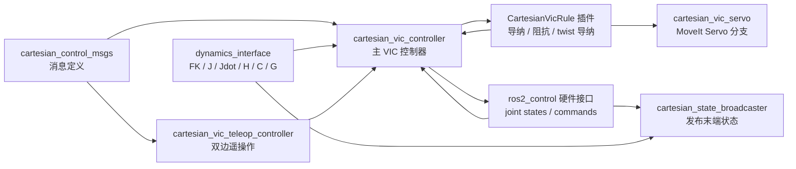
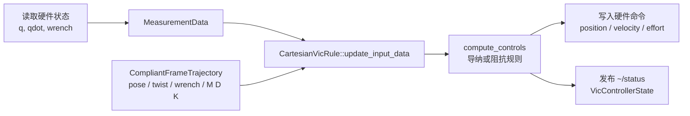

# cartesian_controllers_ros2

面向 `ros2_control` 的笛卡尔空间控制器集合，核心能力是可变阻抗控制（Variable Impedance Control, VIC）。项目提供主 VIC 控制器、笛卡尔状态广播器、MoveIt Servo 版本的导纳控制，以及双边遥操作扩展。

当前开发基于 ROS 2 Jazzy 与 Ubuntu 24.04 LTS。

[](https://github.com/ICube-Robotics/cartesian_controllers_ros2/actions/workflows/ci.yml)

详细的算法原理、架构图、硬件接入清单和未来应用场景见：

[PROJECT_ALGORITHM_ARCHITECTURE.html](./PROJECT_ALGORITHM_ARCHITECTURE.html)

## 安装与构建

```bash
# 创建 ROS 2 工作空间
mkdir -p ws_cartesian_controllers/src
cd ws_cartesian_controllers/src

# 克隆仓库
git clone git@github.com:ICube-Robotics/cartesian_controllers_ros2.git

# 拉取依赖仓库
vcs import . < cartesian_controllers_ros2/cartesian_controllers_ros2.repos

# 回到工作空间根目录
cd ..

# 加载 ROS 2 环境
source /opt/ros/jazzy/setup.bash

# 安装依赖
rosdep install --ignore-src --from-paths . -y -r

# 编译
colcon build --cmake-args -DCMAKE_BUILD_TYPE=Release --symlink-install

# 加载当前工作空间
source install/setup.bash
```

## 项目结构

```text
cartesian_control_msgs
cartesian_state_broadcaster
cartesian_vic_controller
cartesian_vic_servo
cartesian_vic_teleop_controller
```

各包职责如下：

| 包 | 作用 |
| --- | --- |
| `cartesian_control_msgs` | 定义 VIC 控制器、笛卡尔状态、柔顺轨迹和遥操作状态相关消息。 |
| `cartesian_state_broadcaster` | 从关节 `position` 和 `velocity` 状态接口计算并发布末端位姿与速度。 |
| `cartesian_vic_controller` | 主控制器包，包含 `CartesianVicController`、`CartesianVicRule` 基类和默认导纳/阻抗规则插件。 |
| `cartesian_vic_servo` | 基于 MoveIt Servo 的 VIC 导纳实现，VIC 输出 twist，再由 MoveIt Servo 生成关节轨迹。 |
| `cartesian_vic_teleop_controller` | 基于 VIC 的双边遥操作扩展，增加 leader/follower 映射、clutch 和双端柔顺参考生成。 |

项目主要依赖：

- `ros2_control`
- `generate_parameter_library`
- `kinematics_interface`
- `dynamics_interface`
- `pluginlib`
- MoveIt 2 与 `moveit_servo`，仅 `cartesian_vic_servo` 分支需要

## 总体架构



主控制循环如下：



## 控制算法原理

VIC 的目标是在末端笛卡尔空间呈现期望的质量-阻尼-刚度行为，并允许参考力/力矩参与交互控制。

状态定义：

```text
q, qdot                 : 关节位置与速度
x = [p; theta]          : 末端 6D 笛卡尔状态，theta 使用 angle-axis 误差表达
xd = [pd; thetad]       : 期望笛卡尔状态
e  = xd - x
edot = xdot_d - xdot
w_ext = [force; torque] : 末端外部 wrench
```

机械臂关节空间动力学模型：

```text
H(q) qddot + C(q, qdot) + G(q) = tau_cmd + J(q)^T w_ext
```

期望笛卡尔柔顺行为：

```text
M e_ddot + D e_dot + K e = w_ext - w_ref
```

控制器内部计算的笛卡尔加速度命令：

```text
xddot_cmd = xddot_d + M^-1 (K e + D e_dot - w_ext + w_ref)
```

其中 `M`、`D`、`K` 是 6x6 笛卡尔惯量、阻尼和刚度矩阵。默认参数只配置 6 个对角值，代码会将它们组成对角矩阵，并从 `vic.frame.id` 旋转到机器人 base frame。

阻尼比与阻尼的关系：

```text
D_i = 2 zeta_i sqrt(M_i K_i),  i = x, y, z, rx, ry, rz
```

若启用 `vic.use_natural_robot_inertia`，控制器使用机器人自然笛卡尔惯量：

```text
Mx(q) = (J(q) H(q)^-1 J(q)^T)^-1
M = Mx(q)
```

## 导纳控制

`VanillaCartesianAdmittanceRule` 将外力引起的笛卡尔加速度积分为关节速度和关节位置命令，适合 `position` 或 `velocity` 命令接口。

```text
qddot_cmd = J# (xddot_cmd - Jdot(q, qdot) qdot)
qdot_cmd(k) = qdot_cmd(k-1) + qddot_cmd Ts
q_cmd(k)    = q_cmd(k-1)    + qdot_cmd(k) Ts
```

阻尼伪逆：

```text
J# = (J^T J + alpha I)^-1 J^T
```

可选 nullspace 控制项：

```text
N = I - J# J
qddot_null = N M_null^-1 (-D_null qdot + K_null (q_null_d - q) + tau_ext)
qddot_cmd  = qddot_cmd + qddot_null
```

## 阻抗控制

`VanillaCartesianImpedanceRule` 将笛卡尔加速度映射为关节加速度，再通过动力学模型生成力矩命令，适合 `effort` 命令接口。

```text
qddot_cmd = J# (xddot_cmd - Jdot(q, qdot) qdot)
tau_raw = H(q) qddot_cmd + J(q)^T w_ext
```

启用重力和科氏/离心补偿时：

```text
tau_cmd = tau_raw + C(q, qdot) + G(q)
```

未启用补偿时：

```text
tau_cmd = tau_raw
```

自然惯量分支按代码中的简化阻抗形式计算：

```text
qddot_cmd = J# (xddot_d - Jdot qdot) + J^T (K e + D e_dot + w_ref)
tau_raw   = diag(H(q)) qddot_cmd
```

## Twist 导纳控制

`TwistCmdCartesianAdmittanceRule` 只输出笛卡尔 twist，不在 VIC 内部做逆运动学。该规则用于 `cartesian_vic_servo`，由 MoveIt Servo 把 twist 转换为关节轨迹。

```text
twist_cmd(k) = twist_cmd(k-1) + xddot_cmd Ts
```

## 需要接入的硬件数据

| 硬件数据或接口 | 是否需要 | 接入形式 | 用途 |
| --- | --- | --- | --- |
| 每个受控关节的位置 `q` | 必须 | `<joint>/position` state interface | 初始化参考位姿、FK、Jacobian、动力学模型和控制误差计算。 |
| 每个受控关节的速度 `qdot` | 必须 | `<joint>/velocity` state interface | 末端 twist、`Jdot qdot`、加速度估计、阻尼项和动力学补偿。 |
| 关节位置命令接口 | 导纳常用 | `<joint>/position` command interface | 导纳控制可输出积分后的 `q_cmd`。 |
| 关节速度命令接口 | 导纳推荐 | `<joint>/velocity` command interface | 导纳控制主要输出 `qdot_cmd`，README 建议导纳优先接 velocity group。 |
| 关节力矩命令接口 | 阻抗必须 | `<joint>/effort` command interface | 阻抗控制输出 `tau_cmd`。 |
| 六维力/力矩传感器 wrench | 按模式需要 | `ForceTorqueSensor` semantic component，配置 `ft_sensor.name` 和 `ft_sensor.frame.id` | 导纳控制需要外部 wrench；阻抗非自然惯量分支也需要外力估计。 |
| 外部关节力矩 | 可选 | `external_torque_sensor` semantic component | 用于 nullspace 控制中的外部力矩项。 |
| URDF / robot_description | 必须 | ROS 参数 `robot_description`，或从 `robot_state_publisher` 获取 | 动力学插件需要模型结构、关节、base/tip、传感器 frame。 |
| 动力学/运动学插件配置 | 必须 | `dynamics.plugin_name`、`dynamics.plugin_package`、`dynamics.base`、`dynamics.tip` | 计算 FK、`J`、`Jdot`、`H`、`C`、`G` 和自然笛卡尔惯量。 |
| Servo 分支 joint state 与 wrench topic | Servo 需要 | MoveIt planning scene monitor 当前状态；`~/wrench` topic | `cartesian_vic_servo` 获取状态并向 MoveIt Servo 发送 twist。 |
| Teleop follower 状态与 clutch | Teleop 需要 | `/vic_controller_follower/status`、`fd_clutch`、`~/teleoperation_compliance_reference` | 双边遥操作计算 leader/follower 两端参考。 |

最小接入组合：

- 状态广播器：关节 `position` 和 `velocity` state interfaces，外加 URDF 和 kinematics plugin。
- 导纳 VIC：关节 `position`/`velocity` state interfaces，`velocity` 或 `position+velocity` command interfaces，通常还需要 F/T wrench。
- 阻抗 VIC：关节 `position`/`velocity` state interfaces，`effort` command interface，若不用自然惯量分支则需要 F/T wrench。
- MoveIt Servo 分支：MoveIt 可用的实时 joint state、F/T wrench topic、MoveIt Servo 输出的 JointTrajectory 下游控制器。
- 双边 Teleop：leader 本机硬件数据、follower VIC `/status`、follower reference topic、clutch 和 teleop compliance 输入。

## 未来可应用场景

| 应用场景 | 适合的控制形态 | 需要重点接入的数据 | 落地价值 |
| --- | --- | --- | --- |
| 力控装配与插拔 | 导纳 VIC 或阻抗 VIC | 高频关节状态、末端 F/T wrench、准确 TCP/工具坐标、在线柔顺参数 | 适合 peg-in-hole、接插件插拔、卡扣装配、端子压接等接触约束任务。 |
| 表面跟随与恒力加工 | 导纳 VIC | F/T 传感器、末端轨迹参考、工具重力补偿参数、速度/位置命令接口 | 适合打磨、抛光、去毛刺、擦拭等曲面接触任务。 |
| 人机协作与安全拖动 | 导纳 VIC + 低刚度参数 | 关节状态、F/T 或外部力估计、速度命令接口、安全限速/限力层 | 可用于示教拖动、协作搬运和共享工作空间中的顺应避让。 |
| 双边遥操作 | `cartesian_vic_teleop_controller` | leader/follower 两端 `VicControllerState`、两端 F/T wrench、clutch、teleop compliance | 适合危险环境、远程实验、核工业、化工和救援等场景。 |
| 移动操作机器人 | VIC + MoveIt Servo 分支 | MoveIt planning scene、joint state、wrench topic、JointTrajectory 下游控制器 | 适合移动底盘加机械臂系统，在动态环境中处理速度命令、限速和碰撞约束。 |
| 康复、辅助与外骨骼类交互 | 导纳 VIC 或遥操作逻辑扩展 | 人体交互力、关节状态、安全冗余传感器、严格限力限速 | 适合柔顺人机交互研究原型，真机应用需要额外安全认证和冗余保护。 |
| 教学科研平台 | 所有 VIC rule 插件 | 仿真或真实机械臂模型、dynamics plugin、日志和状态 topic | 用于比较导纳、阻抗、自然惯量、nullspace、滤波和柔顺参数对响应的影响。 |

适配路线：

- 短期：仿真验证、状态广播、导纳式柔顺跟踪和 MoveIt Servo twist 分支。
- 中期：打磨、擦拭、装配等接触任务，重点完善 F/T 数据、工具重力补偿、限速限力和任务级状态机。
- 长期：双边遥操作和移动操作系统，重点处理网络延迟、passivity、clutch 映射、碰撞约束、故障回退和多传感器融合。

当前还需要补强的能力：

- 奇异规避仍不完整，复杂真机任务需要更平滑的缩放或约束优化策略。
- 力控任务需要完善工具负载辨识、F/T 零偏校准、接触状态检测和异常力回退策略。
- 工业应用需要任务层安全壳，例如最大速度、最大力、工作空间边界、碰撞监测和急停联动。
- 遥操作应用需要进一步处理通信延迟、丢包、能量一致性和 leader/follower 缩放映射。

## 运行时注意点

- 主 VIC 控制器要求关节 `position` 和 `velocity` 状态接口同时存在。
- 导纳控制通常需要 F/T 传感器；阻抗控制在非自然惯量模式下也依赖外力估计。
- 导纳模式输出 `position`/`velocity` 命令；阻抗模式输出 `effort` 命令；Servo 分支输出 twist 并交给 MoveIt Servo。
- 代码中已有雅可比条件数告警/停止逻辑，但默认 VIC 的奇异规避策略仍不完整，真机使用需要额外安全层。
- 控制器使用 realtime buffer 和 realtime publisher，控制循环内应避免非实时阻塞操作。

## 示例

示例工程见：

[ICube-Robotics/cartesian_controllers_ros2_examples](https://github.com/ICube-Robotics/cartesian_controllers_ros2_examples)
